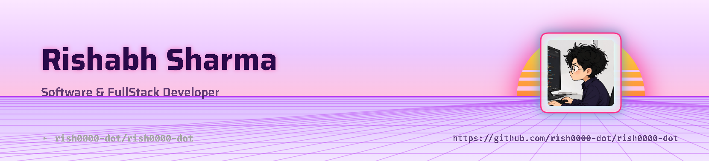

<picture>
  <source media="(prefers-color-scheme: dark)" srcset="art/header-dark.png">
  
</picture>

 

# Hey there, I'm Rishabh Sharma 👋

 

 

## 🧑‍💻 About Me

<table>
<tr>
<td width="65%" valign="top">

- 🔭 Software Developer, currently focused on **Full Stack Development**
- 🌱 Constantly learning new tools, frameworks, and best practices
- 💡 I love building automation tools and practical, real-world projects
- 🌐 Portfolio: **[rishabh-portfolio-zbes.onrender.com](https://rishabh-portfolio-zbes.onrender.com/)**
- 📫 Reach me at **rishabhsharma14426@gmail.com**
- ⚡ Fun fact: I ship fast and break things (then fix them faster)

</td>
<td width="35%" align="center">

</td>
</tr>
</table>

 

## 🛠️ Tech Stack

 

## 📊 GitHub Stats

  

 

 

## 🌐 Connect With Me

 

